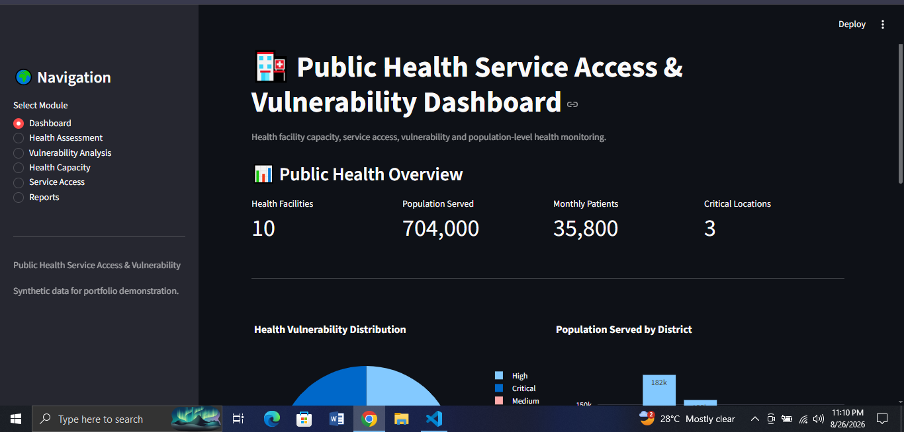

# 🏥 Public Health Service Access & Vulnerability Dashboard

An interactive public health monitoring and vulnerability assessment dashboard built with Python and Streamlit.

## 🚀 Live Demo

👉 Coming Soon

## 📸 Dashboard Preview



## 📌 Project Overview

This project is a public health service access and vulnerability assessment dashboard designed to support data-driven decision-making in health service planning, community development, humanitarian response, and resource prioritization.

The system allows users to monitor health facilities, assess population coverage, analyze vulnerable population groups, evaluate healthcare capacity, monitor essential health services, identify high-vulnerability locations, and generate health assessment reports.

The project uses synthetic data for educational and portfolio purposes.

## 🎯 Objectives

- Monitor health facilities and service coverage
- Assess population served by health facilities
- Identify vulnerable population groups
- Monitor doctors, nurses, and bed capacity
- Assess essential medicine availability
- Monitor maternal and child health services
- Evaluate emergency healthcare access
- Measure distance to healthcare facilities
- Identify health workforce shortages
- Calculate health vulnerability scores
- Prioritize critical and high-vulnerability locations
- Generate downloadable health assessment reports

## 📊 Key Features

### 🏥 Health Facility Assessment

- Add new health facility assessment records
- Record district and upazila
- Identify facility type
- Track population served
- Monitor children, women, elderly, and persons with disabilities
- Record doctors and nurses
- Track available beds
- Monitor monthly patient volume

### ⚠️ Vulnerability Analysis

- Calculate health vulnerability scores
- Classify locations by vulnerability level
- Identify critical and high-vulnerability locations
- Rank locations based on health access and capacity
- Compare vulnerability across districts
- Visualize vulnerability distribution

### 💊 Health Capacity Monitoring

- Monitor doctor availability
- Track nursing staff
- Monitor hospital bed capacity
- Analyze monthly patient volume
- Assess medicine availability
- Compare healthcare capacity across districts

### 🚑 Service Access Analysis

- Monitor maternal health services
- Track child health services
- Monitor emergency services
- Analyze distance to healthcare facilities
- Assess healthcare access gaps
- Analyze vulnerable population coverage

### 📑 Reporting

- Generate full health assessment reports
- Generate critical and high-vulnerability reports
- Generate district-level summaries
- Generate facility-type summaries
- Download reports as CSV files

## 🛠️ Technologies Used

- Python
- Streamlit
- Pandas
- Plotly
- SQLite
- Git & GitHub

## 🗄️ Database

The application uses SQLite for local data storage.

Main database entity:

`health_assessments`

The database stores:

- Assessment date
- District
- Upazila
- Facility type
- Population served
- Children
- Women
- Elderly
- Persons with disabilities
- Doctors
- Nurses
- Beds
- Medicine availability
- Maternal health services
- Child health services
- Emergency services
- Distance to healthcare facility
- Monthly patients
- Health staff shortage
- Vulnerability score
- Vulnerability level

## 🔄 Data Workflow

```text
Health Facility Assessment
          ↓
SQLite Database
          ↓
Data Processing with Pandas
          ↓
Health Capacity Analysis
          ↓
Service Access Analysis
          ↓
Vulnerability Scoring
          ↓
Risk Classification
          ↓
Priority Location Identification
          ↓
Interactive Dashboard
          ↓
Reports & CSV Export